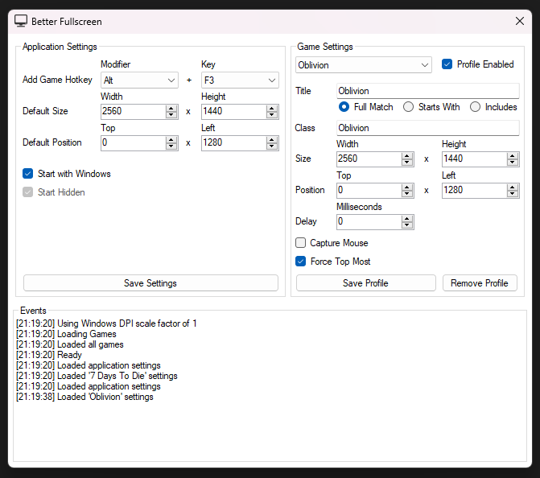

> Better Fullscreen is a small app that enables borderless fullscreen on games, with some extra features

---

 

---

# Table of Contents
- [Features](#features)
- [License](#license)

# Features
- Enable borderless fullscreen on games that dont support it
- Resize and reposition game window
- Force window to become topmost
- Match by window title and class
- Lock mouse to game windows
- Add games with customizable hotkey
- Automatic once a game has been added
- Start automatically with windows
- Customizable delay for setting borderless on windows to allow slow games to load properly
- Portable; all configs stored in `.conf` file and no installation needed

---

# License
THE SOFTWARE IS PROVIDED "AS IS", WITHOUT WARRANTY OF ANY KIND, EXPRESS OR IMPLIED, INCLUDING BUT NOT LIMITED TO THE WARRANTIES OF MERCHANTABILITY, FITNESS FOR A PARTICULAR PURPOSE AND NONINFRINGEMENT. IN NO EVENT SHALL THE AUTHORS OR COPYRIGHT HOLDERS BE LIABLE FOR ANY CLAIM, DAMAGES OR OTHER LIABILITY, WHETHER IN AN ACTION OF CONTRACT, TORT OR OTHERWISE, ARISING FROM, OUT OF OR IN CONNECTION WITH THE SOFTWARE OR THE USE OR OTHER DEALINGS IN THE SOFTWARE.

[Full MIT License](LICENSE.md)
